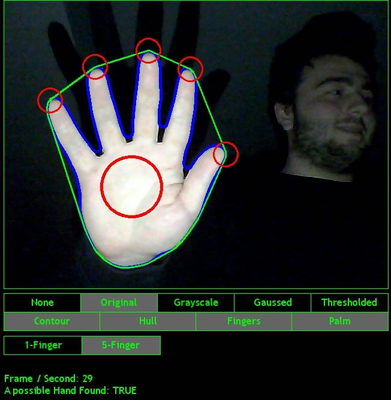

# FingerFinder

A computer vision test project.

It finds your fingertip positions in 3D by using a stereo camera setup. Stereo camera setup I used is just 2 webcams in a dark room with bright light in front of them.

First, fingertip positions are found in each camera feed by using some image processing methods. Objects closer to the camera are brighter in the feed, since the stereo setup is in a dark room and there is a bight light source in front of them. After taking the image, applying some gaussian blur for smoothing, thresholding, passing only the biggest blob, and then edge detection, leaves you with the outline of the hand.

After obtaining the hand outline, fingertips then can be found by thinking this outline as a polar curve and finding it's maxima points. There are many other methods and it's debatable how effective this is.

Then, if cameras are calibrated, their video feed can be rectified and epipolar geometry can be used to obtain 3D real world positions of the fingertips, from their 2D pixel positions on the images.

Written in C++. Used OpenCV library for computer vision related functionality, and SFML for GUI.

In "src" folder:
"Mono" is the souce code of finding fingertips using single camera and being able to see each step in the GUI.
"Stereo" is the source code of camera calibration and finding 3D positions. It doesn't have a nice GUI.

### Here are some screenshots:

